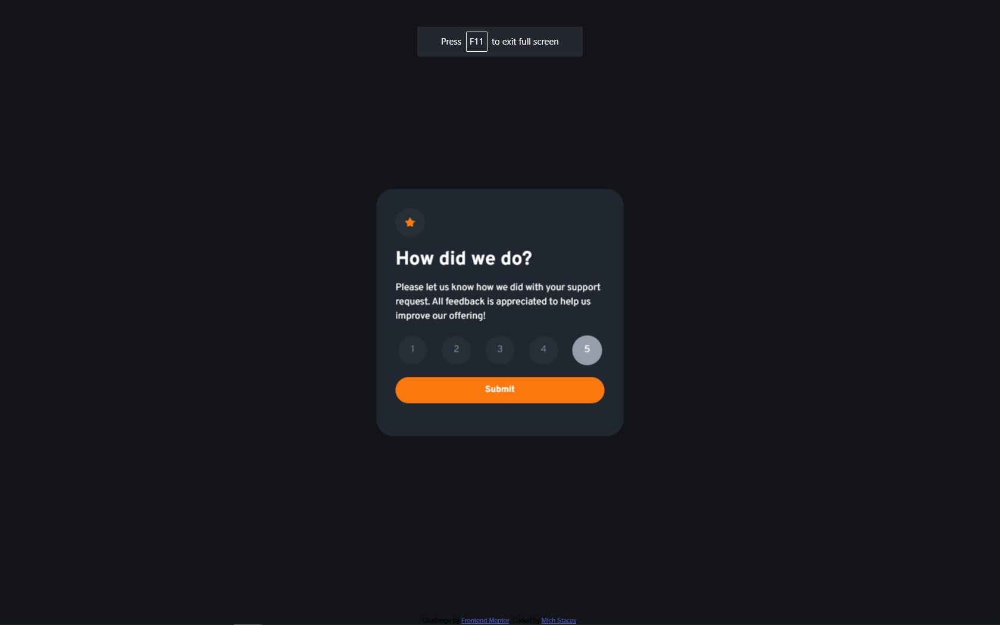
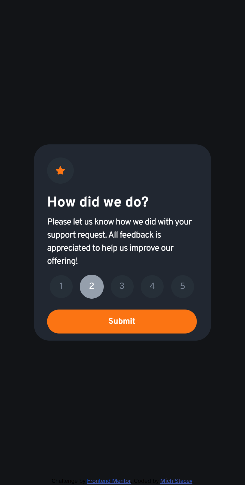
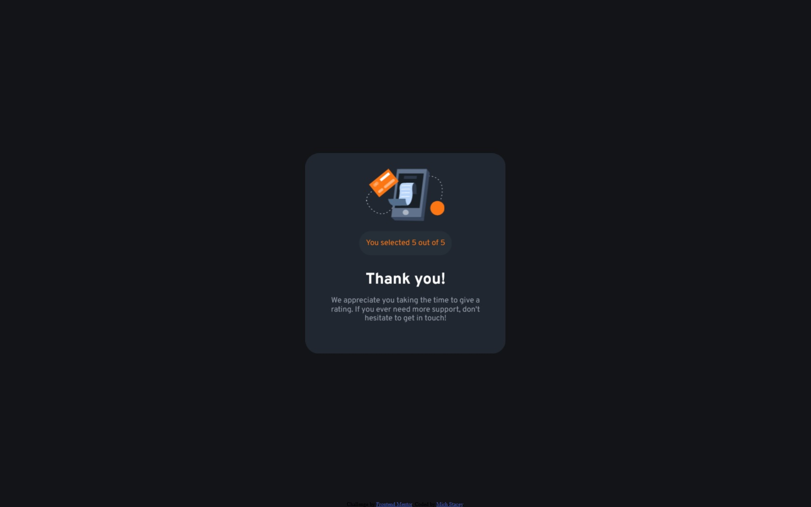
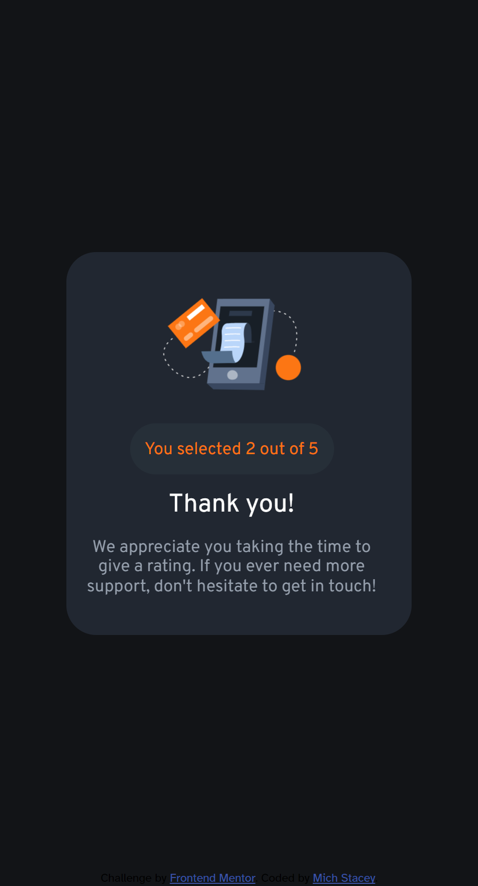

# Frontend Mentor - Interactive rating component solution

This is a solution to the [Interactive rating component challenge on Frontend Mentor](https://www.frontendmentor.io/challenges/interactive-rating-component-koxpeBUmI).

## Table of contents

- [Overview](#overview)
  - [The challenge](#the-challenge)
  - [Screenshot](#screenshots-of-my-solution)
  - [Links](#links)
- [My process](#my-process)
  - [Built with](#built-with)
  - [What I learned](#what-i-learned)
- [Author](#author)

## Overview

### Links

- Live Site URL: [Click here](https://ms-fem-rating-component.netlify.app/)

### The challenge

Users should be able to:

- View the optimal layout for the app depending on their device's screen size
- See hover states for all interactive elements on the page
- Select and submit a number rating
- See the "Thank you" card state after submitting a rating

## Screenshots of My Solution

 

 

## My process

### Built with

- Semantic HTML5 markup
- SASS Flexbox
- Vanilla JavaScript
- Mobile-first workflow

### What I learned

I set up the card so that it flips over when the user hits submit, and I found this was the biggest learning moment I had with the CSS of this project. I found that some of the content was displaying on the wrong side of the card, and I also had to move some elements around on the z-axis;
```css
&.is-flipped {
  transform: translateX(100%) rotateY(-180deg);
}

&__face {
  backface-visibility: hidden;
  transform-style: preserve-3d;
}
```

To get the users input, I chose to use radio selectors as the input. This allowed me to style each input the way I wanted, and apply different properties when it was active or when the user hovered over it.
```html
<input type="radio" name="nav" id="input-1" class="input"/>

<label for="input-1" class="button button-1">1</label>
```
This code runs when the user clicks the button to submit their rating, and it populates the HTML with their response based on which radio selector is currently selected.
```js
let results = document.getElementsByTagName('input');
for (let i = 0; i < 5; i++) {
  if (results[i].checked) {
    document.getElementById('answer').innerHTML = `${i + 1}`
  }
}
```

## Author

<!-- - Website - [Mich Stacey](https://www.your-site.com) -->
- Twitter - [@Mich_Codes](https://twitter.com/Mich_Codes)
- Frontend Mentor - [@mich-codes-sa](https://www.frontendmentor.io/profile/mich-codes-sa)